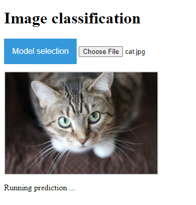

# web_classification

This repo is to set up a simple web page to run oneline image classification. It includes a frontend (built in .js) and a backend (built with python, Flask), communicating through rest API. Frontend will display all supported models and upload image to backend to run prediction. And the backend is reponsible for preprocessing, model prediction and return result.

## setup ##

The following setup has been tested with Windows Cygwin and Linux.

1. clone this project https://github.com/Ronanlfy/web_classification.git

2. go to dir where you save this repo

3. run the setup.sh by `$bash setup.sh` to set up working virtual-env and download packages.

4. start the backend by `$bash run_backend.sh`, the first time will take slightly long time.

5. wait for step 4 finish, open Chrome and go to page http://localhost:5000/ to double-check if the backend is up and running. If it says "Welcome! This is the start page of backend.", now you are free to move on!

6. open web_classification/src/frontend/index.html on Chrome, now you can upload image and start testing!

## Result ##

This chart is obtained from running prediction on win10 once. It displays the probablity (for original and float16 models) and running time to predict a given image. So depends on the hardware, result on running time might vary a lot:

| images \ prediction, time (seconds) | Resnet | Resnet float16 | Resnet int8 | Xception | Xception float16 | Xception int8 | mobilenet | mobilenet float16 | mobilenet int8 |
| -----:|------:| -----:|-----:|-----:|-----:|-----:|-----:|-----:|-----:|
|test_images/cat.png  | tabby, 0.89s|tabby, 0.66s| tabby, 122s|tabby, 1.07s|tabby, 1.6s|tabby, 282s|tabby, 0.68s|tabby, 0.56s|tabby, 20s|
|test_images/dog.png     | Great_Pyrenees, 0.47s|Great_Pyrenees, 0.36s|Great_Pyrenees, 145s|white_wolf, 0.57s|white_wolf, 1.4s| white_wolf, 253s|Eskimo_dog, 0.34s|Eskimo_dog, 0.17s|Eskimo_dog, 23s|

Int8 models run pretty slow, which might be expected since tflite is more optimized on mobile/embedded (e.g. arm). Check out more discussions [here](https://github.com/tensorflow/tensorflow/issues/40183).

## To be notice ##

if want run /src/tools/quantize_model.py

1. replace schema_py_generated.py under your virtualenv site-packages/tensorflow/lite/python

2. download imagenet 2012 dataset manually from [imagenet](http://www.image-net.org/challenges/LSVRC/2012/downloads) and place under ~/tensorflow_datasets/downloads/manual/

## obstacles ##

1. preprocessing method is different from model to model

2. quantize to int models are tricky when prepare representative dataset

## Week 1 summary ##

Now Phase 1 is finished, working on phase 2.

For frontend:

1. Display which model user chose in frontend

2. Add some logic in frontend, like first choose model and then upload image

3. A better structure on the page

For backend:

Try with Pruning if possible.