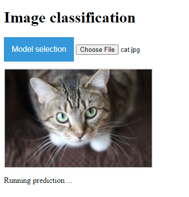
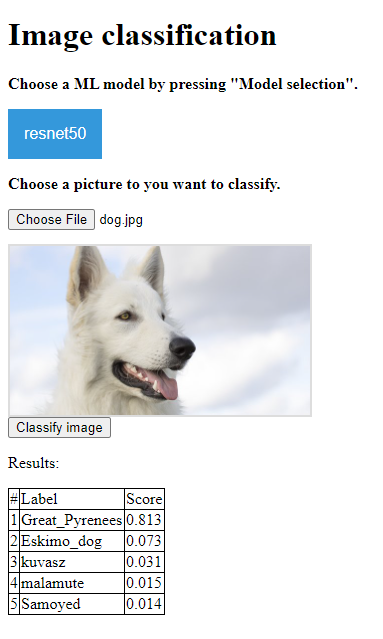

# web_classification

This repo is to set up a simple web page to run oneline image classification. It includes a frontend (built in .js) and a backend (built with python, Flask), communicating through rest API. Frontend will display all supported models and upload image to backend to run prediction. And the backend is reponsible for preprocessing, model prediction and return result.

## Setup ##

The following setup has been tested with Windows Cygwin and Linux.

1. clone this project https://github.com/Ronanlfy/web_classification.git

2. go to dir where you save this repo

3. run the setup.sh by `$bash setup.sh` to set up working virtual-env and install required packages.

4. start the backend by `$bash run_backend.sh`, the first time will take slightly long time.

5. wait for step 4 finish, open Chrome and go to page http://localhost:5000/ to double-check if the backend is up and running. If it says "Welcome! This is the start page of backend.", now you are free to move on!

6. open `/src/frontend/index.html` on Chrome, now you can upload image and start testing!

## Week 1 ##

### Frontend ###

Build frontend where user can choose model and image to run prediction with, and prediction with best accuracy is returned.

### Backend ###

1. Build Flask app to recieve API calls from frontend, including get all supported models and also run prediction with uploaded images.

2. Add Mobilnet, Resnet50, and Xception as supported models.

3. Add three models mentioned above and corresponding float16, int6 quanatized versions.

### Result ###

This chart is obtained from running prediction on win10 once. It displays the probablity (for original and float16 models) and running time to predict a given image. So depends on the hardware, result on running time might vary a lot:

| images \ prediction, time (seconds) | Resnet | Resnet float16 | Resnet int8 | Xception | Xception float16 | Xception int8 | mobilenet | mobilenet float16 | mobilenet int8 |
| -----:|------:| -----:|-----:|-----:|-----:|-----:|-----:|-----:|-----:|
|images/test_images/cat.png  | tabby, 0.89s|tabby, 0.66s| tabby, 47s|tabby, 1.07s|tabby, 1.6s|tabby, 282s|tabby, 0.68s|tabby, 0.56s|tabby, 7.5s|
|images/test_images/dog.png     | Great_Pyrenees, 0.47s|Great_Pyrenees, 0.36s|Great_Pyrenees, 45s|white_wolf, 0.57s|white_wolf, 1.4s| white_wolf, 253s|Eskimo_dog, 0.34s|Eskimo_dog, 0.17s|Eskimo_dog, 5.8s|

Int8 models run pretty slow, which might be expected since tflite is more optimized on mobile/embedded (e.g. arm). Check out more discussions [here](https://github.com/tensorflow/tensorflow/issues/40183).

### Left To Do ###

For frontend:

1. Display which model user chose in frontend

2. Add some logic in frontend, like first choose model and then upload image

3. Dsiplay result on a table with Top 5 accuracy

For backend:

1. Try with Pruning if possible

2. Documentation and code clean up

## Week2 ##

### Frontend ###

Achieve 3 points in previous section about left to do. Now frontend will display which model is chosen, and also results in a table with top 5 accuracy, as shown below.

### Backend ###

A pruning scripts (src/tools/pruning.py) is added to run some pruning with MobileNet on imagenet2012 dataset. And the idea of pruning is trying to push network weights to be sparse / zero, which will decrease the size of the model. 

### Result ###

We use original mobilenet and pruned one to run through the whole imagenet validation dataset with 50000 images:

| model | accuracy | used time | compressed size | 
| -----:|------:| -----:|-----:|
| Original MobileNet  | 0.6917 |228s| 15471k|
| Pruned MobileNet   |   |  |  |

## To Be Notice ##

if want run `/src/tools/quantize_model.py` or `/src/tools/pruning.py`

1. replace `/src/tools/schema_py_generated.py` under your virtualenv site-packages/tensorflow/lite/python

2. download imagenet 2012 dataset manually from [imagenet](http://www.image-net.org/challenges/LSVRC/2012/downloads) and place under ~/tensorflow_datasets/downloads/manual/

## Obstacles ##

1. whole web design is new to me
   
2. preprocessing method is different from model to model

3. quantize to int models are tricky when prepare representative dataset

4. Download imagenets and run with such big dataset.
